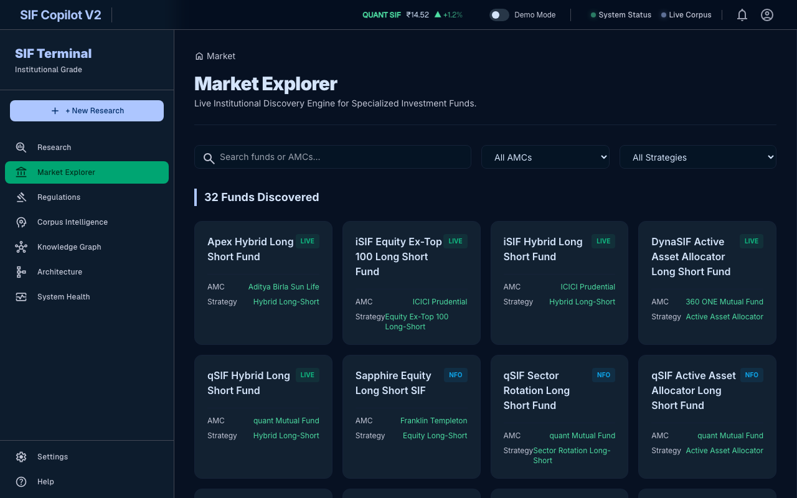
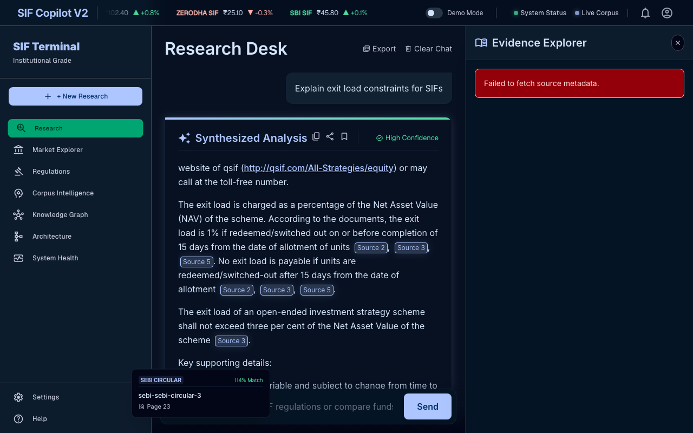
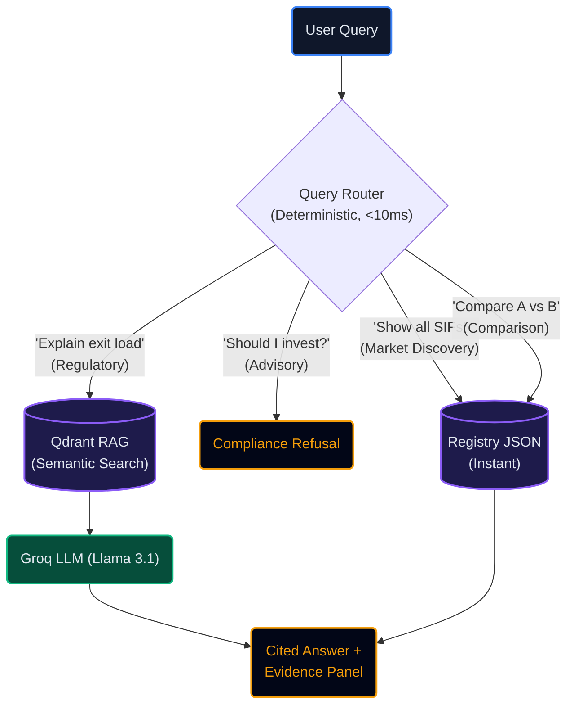

<div align="center">
  
  <h1>SIF Copilot</h1>
  <p><strong>Institutional-Grade AI Research Desk for Specialized Investment Funds</strong></p>

  <p>
    <a href="https://your-vercel-url.vercel.app"></a><br/>
    <em>(Currently optimized for Desktop only)</em>
  </p>

  <p>
    
    
    
    
    
    
  </p>
</div>

---

## 📖 The Problem

Financial analysts spend hours navigating dense 100-page SEBI circulars, AMC factsheets, and Scheme Information Documents to verify compliance limits, compare funds, or check regulatory changes. Standard ChatGPT wrappers fail in finance because they hallucinate numbers and cannot prove their claims.

## 💡 The Solution

**SIF Copilot** is a high-performance, hallucination-free Retrieval-Augmented Generation (RAG) workspace designed specifically for India's new Specialized Investment Funds (SIF) framework.

- 🕵️‍♂️ **100% Verifiable Citations**: Every claim points to a specific document, page number, and paragraph via the sliding Evidence Explorer.
- ⚡ **Sub-second Retrieval**: Powered by Groq LPUs and local Qdrant Vector search for <1.5s total generation latency.
- 📊 **Dynamic Trust Metrics**: Instantly view the underlying chunk count, search latency, and cosine-similarity confidence score for every AI response.
- 🎓 **Strict Compliance Guardrails**: Prompt engineering strictly prohibits the model from offering financial advice.

## 📸 Product Tour

### Market Explorer

*A zero-LLM deterministic routing interface that instantly queries the internal JSON registry for fund discovery.*

### Evidence Explorer & Citations

*Side-by-side RAG answer and source document verification. Users can trace every claim back to the exact paragraph in a SEBI circular or ISID.*

## 🏗️ Architecture

SIF Copilot uses a **Hybrid Imperative** architecture. Qualitative text is processed normally, but quantitative tables are extracted and preserved as atomic units to prevent data tearing. It relies on deterministic routing before falling back to the LLM.



## 🧠 Key PM Decisions

- **Deterministic Routing over Pure LLM**: By parsing intents heuristically *before* hitting the LLM, the app answers "Show me all funds" in <10ms by querying a JSON registry. This drastically reduces token costs, eliminates hallucination for structured data, and provides a snappier UX.
- **Source Authority Ranking**: The retrieval engine weights official SEBI regulatory documents higher than marketing factsheets. This prevents the LLM from prioritizing sales copy over legal realities when answering questions about risk bands or exit loads.
- **Aggressive Sanitization**: 163-page factsheets contained massive amounts of historical performance data that overwhelmed the semantic search space. The ingestion pipeline explicitly strips "Performance" and "Historical NAV" sections to guarantee high-precision retrieval on core compliance questions.

## 💻 Tech Stack

| Layer | Technology | Purpose |
|-------|------------|---------|
| **Frontend** | React 18, Vite, TailwindCSS | High-density, Bloomberg-style UI |
| **Backend** | Python, FastAPI, Pydantic | Asynchronous API layer |
| **Vector DB** | Qdrant | Local semantic search |
| **Embeddings** | BAAI/bge-small-en-v1.5 | Fast, compact document vectorization |
| **Inference** | Groq Llama-3.1-8b-instant | Ultra-low latency generation |
| **Ingestion** | PyMuPDF, pdfplumber, OCRmyPDF | Table-preserving PDF extraction |

## 🚀 Local Setup

### Prerequisites
- Python 3.9+
- Node.js 18+
- Groq API Key

### 1. Backend Setup
```bash
git clone https://github.com/Flukeshotz/SIF_RAG.git
cd SIF_RAG
python -m venv venv
source venv/bin/activate
pip install -r requirements.txt

# Configure environment
cp .env.development .env
# Edit .env and add your GROQ_API_KEY

# Start FastAPI server
python -m api.main
```

### 2. Frontend Setup
```bash
cd frontend
npm install
npm run dev
```
Visit `http://localhost:5173` in your browser.

## 🐳 Docker Deployment
```bash
docker-compose up --build -d
```

## 🗺️ Roadmap
- [ ] Connect Airflow for nightly SEBI RSS feeds.
- [ ] Add Cross-Encoder Reranking for dense regulatory queries.
- [ ] Implement GraphRAG for tracking complex entity relationships (Fund Managers to AMCs).

## 📄 License
This project is licensed under the MIT License - see the [LICENSE](LICENSE) file for details.
