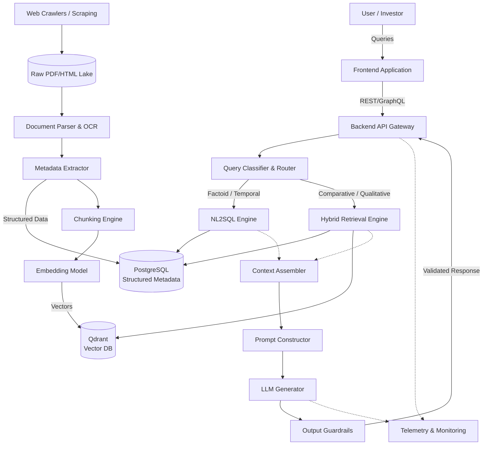

# SIF Copilot: Architecture Document

## 1. Executive Summary

**Problem:** 
Specialized Investment Funds (SIFs) represent a newly regulated, highly complex asset class in India, positioned between Mutual Funds and Alternative Investment Funds. Investors and advisors struggle to navigate the dense, fragmented, and disparate official documentation (SIDs, KIMs, Factsheets, Regulatory Circulars) required to understand, compare, and allocate capital to SIFs safely.

**Why RAG is Needed:** 
Standard Large Language Models (LLMs) hallucinate financial details, lack access to real-time fund data, and cannot trace claims back to legally binding source documents. A Retrieval-Augmented Generation (RAG) architecture bridges this gap by grounding all generative responses in verified, official financial text, ensuring accuracy and compliance.

**Why Vector Search Alone is Insufficient (The Hybrid Imperative):**
Financial inquiries frequently involve deterministic thresholds (e.g., "Find SIFs with a minimum investment of ₹10 Lakh and an exit load < 1%"). Vector databases excel at qualitative, semantic similarity but fail catastrophically at hard boolean logic, mathematical filtering, and sorting numerical values. Furthermore, the corpus size for SIFs is currently highly restricted (max 7 strategies per AMC, ~10-15 AMCs). 

**The Solution:** 
A strictly bifurcated **Hybrid Architecture** is required. Qualitative investment philosophies and complex regulatory nuances are routed to a high-dimensional Vector Database (Qdrant), while deterministic, quantitative metrics (AUM, exact exit loads, operational dates) are routed to a Relational Database (PostgreSQL). 

---

## 2. System Architecture Overview

---

## 3. High-Level Component Architecture

1. **Frontend (Next.js / React):** Provides the interactive chat interface, structured comparison tables, and user dashboard. Renders UI elements based on the query response type.
2. **API Layer (FastAPI):** Orchestrates requests, handles authentication, and acts as the synchronous gateway between the frontend and the underlying LLM pipelines.
3. **Retrieval Engine (LangChain / LlamaIndex core):** Executes the retrieval strategy (dense vector search + sparse BM25) and integrates reranking models.
4. **Embedding Pipeline:** Converts chunks into high-dimensional vectors. Crucial for establishing semantic similarity between user queries and the corpus.
5. **Vector Database (Qdrant):** Stores the embedded qualitative text chunks. Optimized for HNSW (Hierarchical Navigable Small World) index searches.
6. **Metadata Database (PostgreSQL):** Stores strictly typed, extracted entities (Exit Loads, Min Investment, Fund Manager) to facilitate exact-match SQL queries.
7. **LLM Layer:** The generative engine that synthesizes the retrieved context into a natural language response, rigorously citing sources.
8. **Monitoring Layer (LangSmith / DataDog):** Tracks prompt latency, token costs, hallucination rates, and user feedback (thumbs up/down).

---

## 4. Data Source Architecture

Based on rigorous analysis of the Indian financial ecosystem, sources are categorized into strict priority tiers:

| Tier | Source Type | Examples | Rationale | Retrieval Priority |
|---|---|---|---|---|
| **Tier 1** | SEBI Circulars & Master Directions | Regulatory Framework (Feb 2025) | Absolute legal ground truth. Defines immutable constraints (e.g., 25% short limit). | Highest (Overrides all) |
| **Tier 2** | AMFI Guidelines & SOPs | ARN-29 Circular | Defines compliance, NAV standardization, and distributor requirements. | High |
| **Tier 3** | ISIDs & KIMs | Tata Titanium ISID | Legally binding AMC-investor contracts detailing exact fund strategies and limits. | High (Product specific) |
| **Tier 4** | Monthly Factsheets | Quant qSIF Factsheet | Dynamic, time-bound portfolio holdings and fund manager commentary. | Medium (Requires temporal context) |
| **Tier 5** | AMC Websites, Brochures, FAQs | DSP SIF Philosophy | Translates legalese into educational narratives. Prone to marketing bias. | Low (Educational use only) |

---

## 5. Ingestion Architecture

- **Document Discovery:** Automated crawlers poll SEBI/AMFI index pages daily. Headless browsers (Playwright) monitor SPA AMC sites to trigger downloads behind UI modals.
- **Document Download:** Files are securely downloaded over HTTPS.
- **Versioning (Crucial):** AMC URLs are unstable (e.g., `qsif_May_2026.pdf`). Files are hashed (SHA-256) and permanently stored in an immutable S3 bucket. All downstream citations link to this *internal immutable URL*, not the fragile AMC URL.
- **Parsing:** 
  - *HTML:* Headless DOM extraction.
  - *PDFs:* Layout-aware models (LayoutLM) capture structural hierarchies and bounding boxes to separate text from tabular data.
- **Metadata Extraction:** NER (Named Entity Recognition) and Regex extract deterministic fields (fund name, exit loads) prior to chunking.

---

## 6. Document Processing Strategy

- **SEBI Circular:** OCR + Layout parser. *Must* preserve the hierarchical numbering system (e.g., 5.1.1 nested under 5.1). Stored in Qdrant with deep parent-child relational metadata.
- **ISID:** Table-aware deep learning parser. Extracts tabular asset allocation limits into Markdown/HTML to preserve mathematical relationships before chunking.
- **KIM:** Similar to ISID, but parsed for rapid extraction of core operational parameters.
- **Factsheet:** Split routing. Qualitative macroeconomic commentary is vectorized. The raw portfolio holdings table is *never* vectorized; it is extracted directly into the PostgreSQL relational database to allow precise "stock exposure" queries.
- **AMC Website & FAQ:** Headless browser extraction. FAQs are strictly parsed into Q&A pairs.

---

## 7. Metadata Architecture

Metadata is critical for pre-filtering vector searches and executing deterministic SQL queries.

- `fund_name`: (String) Target specific funds (e.g., "Tata Titanium SIF").
- `amc`: (String) Filter by manufacturer (e.g., "Quant Mutual Fund").
- `category`: (String) SEBI classification (e.g., "Hybrid Long-Short"). Essential for constrained comparisons.
- `risk_band`: (Integer 1-5) Standardized SEBI risk-o-meter rating.
- `minimum_investment`: (Numeric) Strictly ₹10 Lakh for SIFs. Used for boolean validation.
- `document_type`: (String) Maps to Tiers (ISID, KIM, Circular). Drives retrieval priority.
- `publication_date`: (Date) Resolves temporal queries (e.g., "What was the AUM last month?").
- `source_url`: (String) The internal immutable S3 permalink used for verified citations.
- `effective_date`: (Date) When a regulatory rule becomes active (e.g., April 1, 2025).

---

## 8. Chunking Strategy

| Source Type | Strategy | Size / Overlap | Rationale |
|---|---|---|---|
| **SEBI Circulars** | Hierarchical | Parent: 1500, Child: 300 | Prevents severing legal sub-clauses from their parent context. |
| **ISIDs / KIMs** | Hybrid (Semantic + Tabular) | 512 / 128 | Qualitative text is split semantically. Tables are kept intact as single Markdown entities. |
| **Factsheets** | Split Pipeline | Text: 512, Holdings: DB | Vectorizes commentary; routes tabular holdings strictly to PostgreSQL. |
| **FAQs** | Q&A Pair | Exact Pair boundaries | Prevents conflating the answer of one question with another. |
| **Websites** | Semantic | 768 / 128 | Captures broader philosophical and marketing narratives. |

---

## 9. Embedding Architecture

**Recommendation: BGE-M3 (BAAI General Embedding - Multilingual, Multi-granularity, Multi-task)**

*Alternatives Evaluated:*
- *OpenAI (`text-embedding-3-small`):* High recurring cost; data privacy concerns regarding financial documents.
- *BGE Large:* English-centric, high memory footprint.

*Why BGE-M3?*
- **Cost:** Open-source, deployable locally or on scalable cloud inference endpoints. Zero API cost per token.
- **Retrieval Quality:** Excels at dense retrieval and captures nuanced semantic relationships effectively for financial terminology.
- **Multilingual:** While initially English, BGE-M3 provides future-proofing for vernacular Indian languages (Hindi, Gujarati) critical for retail expansion.

---

## 10. Storage Architecture

**Relational Database (PostgreSQL):**
Houses exact-match, deterministic, and tabular metrics.
*Examples:* AUM figures, daily NAV, total expense ratios (capped at 2.25%), precise exit load structures (e.g., "0.50% if < 90 days"), notice periods.

**Vector Database (Qdrant):**
Houses unstructured narratives, qualitative philosophy, and complex legalese.
*Examples:* "Explain the dynamic asset allocation logic of 360 ONE DynaSIF", "What is DSP's stance on downside protection?", "SEBI's rationale for 25% unhedged short limits."

---

## 11. Retrieval Architecture

1. **Query Routing:** Determines if the query is deterministic (SQL) or semantic (Vector).
2. **Metadata Pre-filtering:** If the user asks about "Hybrid SIFs", a metadata filter (`category == 'Hybrid Long-Short'`) is immediately applied to the Qdrant query to slash the search space.
3. **Hybrid Retrieval:** Qdrant executes Dense Vector Search (Cosine Similarity) alongside Sparse Keyword Search (BM25) to ensure specific financial acronyms (e.g., 'AIF', 'PMS') are perfectly matched.
4. **Reranking:** A cross-encoder model (e.g., `bge-reranker-large`) re-scores the top-K retrieved chunks to maximize precision before feeding them to the LLM context window.

---

## 12. Query Classification Layer

A lightweight classifier router (via small LLM or fast intent-matching ML model) directs traffic:

- **Factoid/Product (NL2SQL):** "What is the exit load?" -> Routes to PostgreSQL.
- **Regulatory (Vector):** "Can SIFs use leverage?" -> Routes to Qdrant (Tier 1 Priority).
- **Comparison (Parallel Vector/SQL):** "Compare Fund A and Fund B" -> Executes simultaneous queries for both entities, aggregates results.
- **Advisory (Blocked):** "Which SIF should I buy?" -> Routes directly to hardcoded compliance rejection string.

---

## 13. Generation Architecture

- **Prompt Construction:** The system prompt explicitly defines the persona ("SIF Research Analyst AI") and strict behavioral bounds.
- **Context Assembly:** Retrieved chunks are injected sequentially into the prompt window.
- **Citation Handling:** The LLM is instructed to append `[Source X]` to claims. A post-processing script maps `[Source X]` to the immutable S3 `source_url` from the chunk metadata.
- **Hallucination Prevention:** If retrieved context is insufficient, the prompt forces the LLM to output: *"I could not find this information in the available official documents."*

---

## 14. Guardrails and Compliance

Strict programmatic guardrails are non-negotiable for SEBI compliance:
- **Investment Advice Detection:** Regex and semantic classifiers detect intent verbs ("buy", "sell", "invest in", "best").
- **Action:** Intercepts and returns: *"I can explain and compare SIFs based on official information, but I cannot provide personalized investment recommendations..."*
- **Return Prediction Blocking:** Blocks any generation attempting to forecast NAV or yield.
- **PII Handling:** Scanners drop any PAN/Aadhaar/Bank Account entities before they hit the query router.

---

## 15. Evaluation Framework

Automated offline evaluation using **RAGAS** / **DeepEval**:
- **Faithfulness:** Does the generated answer derive *only* from the retrieved chunks? (Minimizes hallucinations).
- **Answer Relevance:** Does the answer address the actual user query?
- **Context Precision/Recall:** Did Qdrant retrieve the correct sections of the ISID?
- **Citation Accuracy:** Are the appended links functioning and contextually correct?
- **Latency/Cost:** Tracked via LangSmith. Target: < 5 seconds P99 response time.

---

## 16. Monitoring Architecture

- **Tracing (LangSmith):** Visualizes the exact DAG execution path (Routing -> Retrieval -> Reranking -> Generation).
- **Logs (DataDog/ELK):** Captures application-level errors and ingestion pipeline failures (e.g., Headless browser timeouts).
- **Corpus Health:** Automated alerts if an AMC URL begins returning 404s, prompting an update to the ingestion crawler.
- **Feedback Loop:** UI buttons (👍 / 👎) log directly to the telemetry database to identify weak retrieval queries.

---

## 17. Scalability Roadmap

- **Phase 1 (MVP):** SIF Only. Establishes the core pipeline.
- **Phase 2 (Mutual Funds):** Introduces massive scale. Requires distributed web crawlers for daily NAV/Factsheet updates across 40+ AMCs. Qdrant cluster scaling.
- **Phase 3 (PMS):** Ingests highly unstructured, non-standardized private placement memorandums. Requires heavier reliance on advanced layout-aware parsers.
- **Phase 4 (AIF):** Expands the vector space to complex illiquid asset strategies.
- **Phase 5 (Wealth Copilot):** A unified semantic space allowing cross-asset comparisons (SIF vs PMS vs AIF) driven by a highly advanced multi-agent router.

---

## 18. Cost Analysis

- **MVP (Months 1-2):** ~$500/mo. Local BGE embeddings, single Qdrant node, Gemini 1.5 Flash/Pro via API (low token volume), AWS S3/EC2.
- **Pilot (Months 3-6):** ~$1,500/mo. Managed Qdrant cluster, dedicated ingestion servers (Playwright is resource-heavy), higher LLM API throughput.
- **Production (Scale):** ~$3,000+/mo. Multi-node Qdrant, Enterprise LLM rate limits, advanced DataDog telemetry, high-availability architecture.

---

## 19. Risks and Failure Modes

| Risk Type | Description | Mitigation |
|---|---|---|
| **Technical** | AMC SPAs block scraping scripts. | Rotate IPs; use advanced stealth headless browsers. |
| **Data/Citation** | AMC deletes historical PDF, breaking links. | **Mandatory immutable S3 versioning.** Never hotlink. |
| **Compliance** | LLM gives inadvertent financial advice. | Strict intent classification router + rigid system prompting. |
| **Retrieval** | Vector search returns wrong number (e.g., 0.5% vs 1%). | Bifurcate architecture. Route numerical metrics to SQL. |
| **Hallucination** | LLM invents a SEBI rule. | Enforce RAGAS faithfulness metrics; lower LLM temperature to 0. |

---

## 20. Architecture Decision Record (ADR)

| Decision | Alternatives Considered | Reason Chosen |
|---|---|---|
| **Bifurcated DB (SQL + Vector)** | Vector DB only with metadata filtering. | Vectors cannot perform complex numerical aggregation or sorting. Essential for financial product comparison. |
| **Qdrant** | Chroma, Pinecone. | Qdrant offers superior hybrid search (Dense + Sparse) out-of-the-box and handles complex payload filtering efficiently. |
| **BGE-M3** | OpenAI `text-embedding-3-small`. | Open-source, zero recurring cost, multilingual support for future localization. |
| **Immutable Internal S3 Citations** | Hotlinking directly to AMC PDFs. | AMC URLs are highly volatile. Hotlinking destroys legal auditability and degrades user trust when links 404. |
| **LayoutLM / Table-Aware Parsers** | PyPDF2, standard OCR. | Standard OCR destroys tabular asset allocation limits in ISIDs, creating garbage embeddings. |
