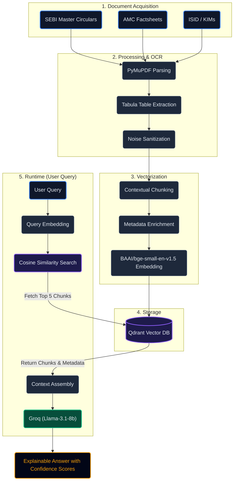

# Architecture Diagram

The SIF Copilot relies on a "Hybrid Imperative" Retrieval-Augmented Generation (RAG) architecture. Qualitative text is processed normally, but quantitative tables are extracted and preserved as atomic units to prevent data tearing.

## Data Pipeline

